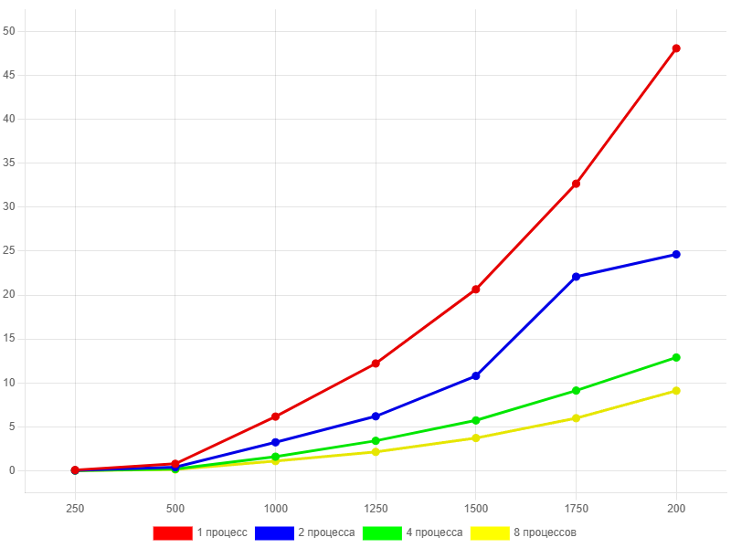
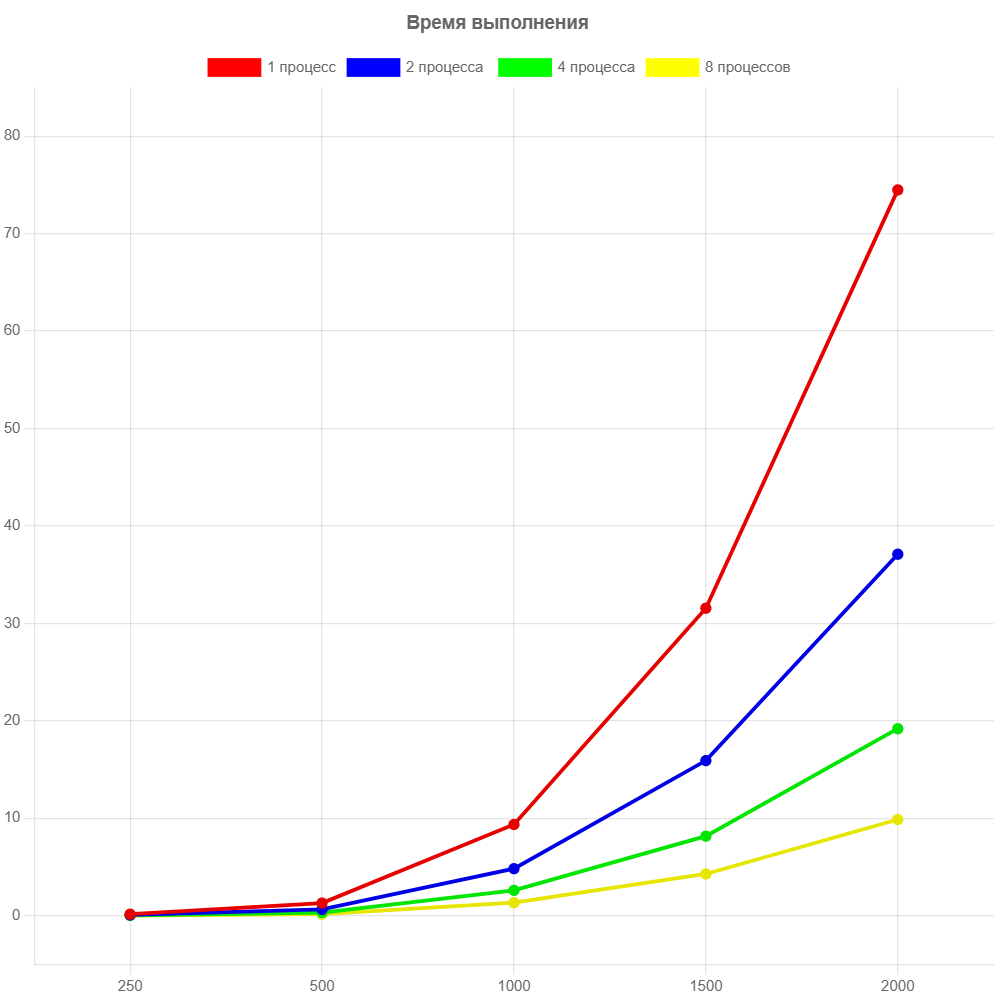
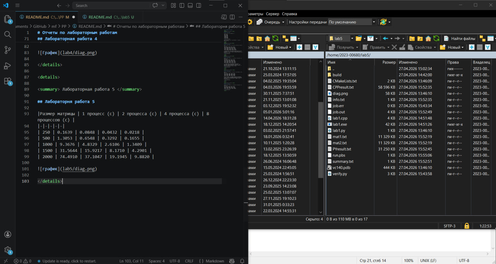

# Отчеты по лабораторным работам

Лабораторная работа 1 

## Лабораторная работа 1

| Размер матрицы | Время выполнения (с) |
|-|-|
| 250| 0.0540|
| 500| 	0.4504|
| 750| 	1.4959|
| 1000| 3.4774|
| 1250| 6.7107|
| 1500| 16.8666|
| 1750| 24.0424|
| 2000| 29.1561|

График зависимости времени от размера показывает рост, близкий к кубическому (O(N^3))

Лабораторная работа 2

## Лабораторная работа 2

|Размер матрицы | 1 поток (c) | 2 потока (с) | 4 потока (с) | 8 потоков (с) |
|-|-|-|-|-|
| 250 | 0.2497 | 0.1428 | 0.0791 | 0.0575 |
| 500 | 1.6439 | 0.9228 | 0.5287 | 0.3807 |
| 1000 | 13.5908 | 7.4245 | 4.1345 | 2.8394 |
| 1250 | 26.2150 | 13.1753 | 8.4816 | 5.9433 |
| 1500 | 47.4809 | 22.4695| 12.8117 | 9.4556 |
| 1750 | 74.9263 | 37.8119 | 19.8938 | 13.3850 |
| 2000 | 113.0300 | 55.6699 | 32.1849 | 19.6344 |

При изучении таблицы времени выполнения операции умножения квадратных матриц заметно, что время умножения матриц одной размерности, при увеличении кол-ва потоков в 2 раза время выполнения операции уменьшается приблизительно в 2 раза.

Лабораторная работа 3

## Лабораторная работа 3

|Размер матрицы | 1 процесс (c) | 2 процесса (с) | 4 процесса (с) | 8 процессов (с) |
|-|-|-|-|-|
| 250 | 0.0948 | 0.0501 | 0.0393 | 0.0230 |
| 500 | 0.8016 | 0.4153 | 0.2039 | 0.1589 |
| 1000 | 6.1723 | 3.2491 | 1.6099 | 1.1140 |
| 1250 | 12.2158 | 6.2055 | 3.4182 | 2.1549 |
| 1500 | 20.6469 | 10.7957 | 5.7389 | 3.7331 |
| 1750 | 32.6643 | 22.0833 | 9.1337 | 5.9907 |
| 2000 | 48.0617 | 24.6271 | 12.894 | 9.1137 |

При сравнении таблиц времени выполнение умножения таблиц с использованием технологий OpenMP и MPI, можно заметить, что MPI приблительно в 2 раза быстрее справился с задачей. Как и при использовании OpenMP, при увеличении кол-ва потоков в 2 раза, время выполнения так же уменьшается примерно в 2 раза. 

 Лабораторная работа 4 

## Лабораторная работа 4

|Размер матрицы | Блок 4х4 (с) | Блок 8х8  (с) | Блок 16х16 (с) | Блок 32х32 (с) |
|-|-|-|-|-|
| 500 |  0.0018 | 0.0009 | 0.0008 | 0.0008 |
| 1000 | 0.0126 | 0.0062 | 0.0067 | 0.0067 |
| 1500 | 0.0419 | 0.0209 | 0.0207 | 0.0210 |
| 2000 | 0.1034 | 0.0494 | 0.0514 | 0.0501 |
| 5000 | 1.6569 | 0.7696 | 0.7709 | 0.7796 |

Как видно из таблицы, время выполнения умножения матриц значительно меньше по сравнению с CPU реализациями. Наименьшее время выполнения достигает при размере блока 8х8. Дальнейшее увеличение блока до 16х16, 32х32 не дает прироста производительности - разница во времени в пределах погрешности. 

 Лабораторная работа 5 

## Лабораторня работа 5

|Размер матрицы | 1 процесс (c) | 2 процесса (с) | 4 процесса (с) | 8 процессов (с) |
|-|-|-|-|-|
| 250 | 0.1639 | 0.0848 | 0.0432 | 0.0218 |
| 500 | 1.3053 | 0.6548 | 0.3292 | 0.1655 |
| 1000 | 9.3676 | 4.8329 | 2.6106 | 1.3409 |
| 1500 | 31.5644 | 15.9217 | 8.1710 | 4.2901 |
| 2000 | 74.4910 | 37.1047 | 19.1945 | 9.8820 |

Во время выполнения данной лабораторной работы были получены навыки использования суперкомпьютера "Сергей Королев", а также работы в приложениях PuTTY и WinSCP. По результатам проведения экспериментальных измерений, видно, что время выполнения примерно в 1.5-2 раза дольше, чем в 3 лабораторной работе. При это просматривается та же закономерность уменьшения времени выполнения работы в 2 раза при увеличении кол-ва процессов в 2 раза.

