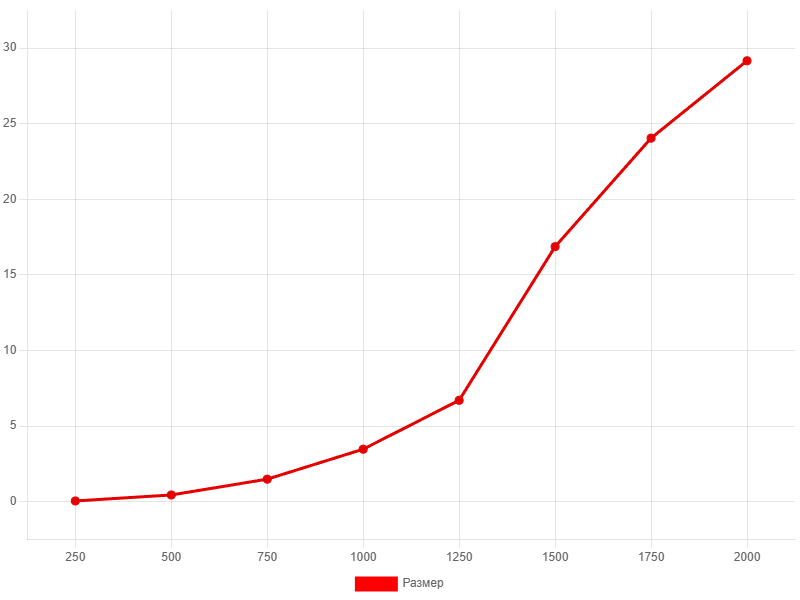
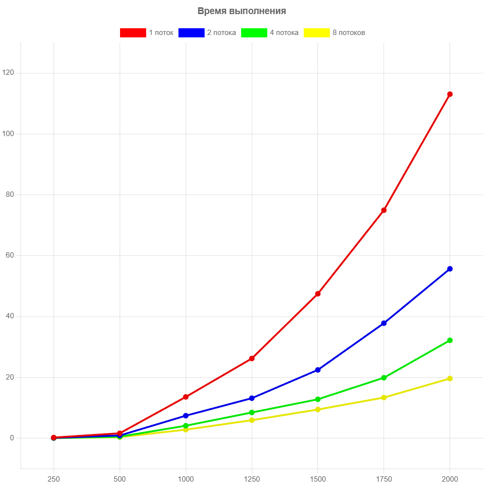

# Отчеты по лабораторным работам

Лабораторная работа 1 

## Лабораторная работа 1

| Размер матрицы | Время выполнения (с) |
|-|-|
| 250| 0.0540|
| 500| 	0.4504|
| 750| 	1.4959|
| 1000| 3.4774|
| 1250| 6.7107|
| 1500| 16.8666|
| 1750| 24.0424|
| 2000| 29.1561|

График зависимости времени от размера показывает рост, близкий к кубическому (O(N^3))

Лабораторная работа 2

## Лабораторная работа 2

|Размер матрицы | 1 поток (c) | 2 потока (с) | 4 потока (с) | 8 потоков (с) |
|-|-|-|-|-|
| 250 | 0.2497 | 0.1428 | 0.0791 | 0.0575 |
| 500 | 1.6439 | 0.9228 | 0.5287 | 0.3807 |
| 1000 | 13.5908 | 7.4245 | 4.1345 | 2.8394 |
| 1250 | 26.2150 | 13.1753 | 8.4816 | 5.9433 |
| 1500 | 47.4809 | 22.4695| 12.8117 | 9.4556 |
| 1750 | 74.9263 | 37.8119 | 19.8938 | 13.3850 |
| 2000 | 113.0300 | 55.6699 | 32.1849 | 19.6344 |

При изучении таблицы времени выполнения операции умножения квадратных матриц заметно, что время умножения матриц одной размерности, при увеличении кол-ва потоков в 2 раза время выполнения операции уменьшается приблизительно в 2 раза.

