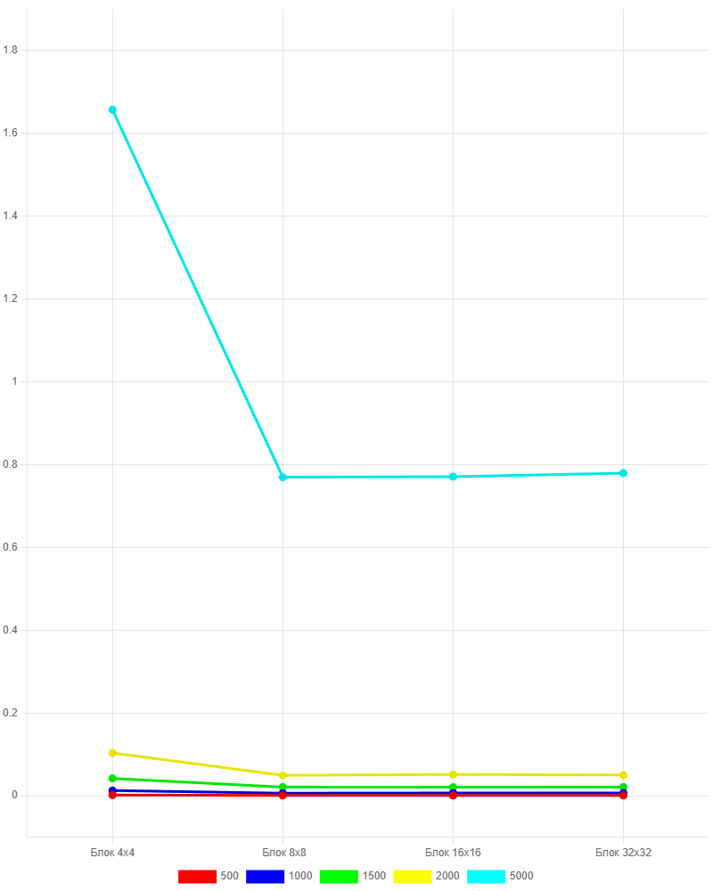

## Лабораторная работа 4

|Размер матрицы | Блок 4х4 (с) | Блок 8х8  (с) | Блок 16х16 (с) | Блок 32х32 (с) |
|-|-|-|-|-|
| 500 |  0.0018 | 0.0009 | 0.0008 | 0.0008 |
| 1000 | 0.0126 | 0.0062 | 0.0067 | 0.0067 |
| 1500 | 0.0419 | 0.0209 | 0.0207 | 0.0210 |
| 2000 | 0.1034 | 0.0494 | 0.0514 | 0.0501 |
| 5000 | 1.6569 | 0.7696 | 0.7709 | 0.7796 |

Как видно из таблицы, время выполнения умножения матриц значительно меньше по сравнению с CPU реализациями. Наименьшее время выполнения достигает при размере блока 8х8. Дальнейшее увеличение блока до 16х16, 32х32 не дает прироста производительности - разница во времени в пределах погрешности. 

